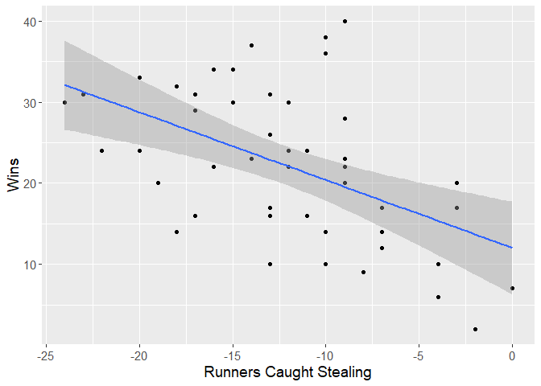

NPF Regression Analysis
================
MAL
10/30/2021

### This analysis utilizes a data file I compiled myself based on public data on the National Pro Fastpitch website

``` r
npf <- read.csv('https://raw.githubusercontent.com/MaggieLangheim/mlbRegAnalysis/main/npfData.csv')
```

### First, plot a scatterplot to determine the type of relationship bewteen stolen bases on offense and total wins. Based on the plot below, there is a positive linear relationship between the two.

``` r
ggplot(npf,
       aes(x=SB, y= W)) +
  geom_point() +
  geom_smooth(method='lm') +
  theme(text = element_text(size = 14)) +
  labs(x = "Stolen Bases", y = "Wins")
```

    ## `geom_smooth()` using formula 'y ~ x'

<!-- -->

### Next, we fit a model to the data. Below is a simple linear model of the relationship between stolen bases and total wins.

``` r
sb_model <- lm(npf$W ~ npf$SB)
summary(sb_model)
```

    ## 
    ## Call:
    ## lm(formula = npf$W ~ npf$SB)
    ## 
    ## Residuals:
    ##      Min       1Q   Median       3Q      Max 
    ## -15.8867  -4.6840   0.7997   3.6225  18.8954 
    ## 
    ## Coefficients:
    ##             Estimate Std. Error t value Pr(>|t|)    
    ## (Intercept) 11.06795    2.26109   4.895  1.3e-05 ***
    ## npf$SB       0.31365    0.05571   5.630  1.1e-06 ***
    ## ---
    ## Signif. codes:  0 '***' 0.001 '**' 0.01 '*' 0.05 '.' 0.1 ' ' 1
    ## 
    ## Residual standard error: 7.251 on 45 degrees of freedom
    ## Multiple R-squared:  0.4133, Adjusted R-squared:  0.4002 
    ## F-statistic:  31.7 on 1 and 45 DF,  p-value: 1.103e-06

### The model includes multiple R square, coefficients, and p-values which are all beneficial to describing the effect stolen bases have on total wins.

### The multiple R square shows how much the number of stolen bases effect the total number of wins. Since each season in the NPF did not have a uniform number of games for every team each season. However, 41.3% of the variation in wins can be explained by stolen bases.

### The next important point to look at is the coefficient which shows how many stolen bases it takes for one additional win. So based on this NPF data, it takes 3 additional stolen bases on the season to win an extra game.

### The last statistic to look is the p-value which indicates whether or not the relationship is caused by something other than chance. For the relationship between stolen bases and total wins, the p-value is very small (\< 0.01), so this stolen bases is very meaningful when looking at what effects wins.

``` r
#ggplot(npf,
#      aes(x=SB, y= W, color = OBP)) +
  #geom_point() +
  #geom_smooth(method='lm') +
  #theme(text = element_text(size = 14)) +
  #labs(x = "Stolen Bases", y = "Wins")
```

### Next is a scatterplot to determine the type of relationship bewteen runners caught stealing on defense and total wins. Based on the plot below, there is a positive linear relationship between the two.

``` r
ggplot(npf,
       aes(x=CS, y= W)) +
  geom_point() +
  geom_smooth(method='lm') +
  theme(text = element_text(size = 14)) +
  labs(x = "Runners Caught Stealing", y = "Wins")
```

    ## `geom_smooth()` using formula 'y ~ x'

<!-- -->

### Next, we fit a model to the data. Below is a simple linear model of the relationship between caught stealing and total wins.

``` r
csb_model <- lm(npf$W ~ npf$CS)
summary(csb_model)
```

    ## 
    ## Call:
    ## lm(formula = npf$W ~ npf$CS)
    ## 
    ## Residuals:
    ##      Min       1Q   Median       3Q      Max 
    ## -13.1001  -5.8925  -0.2923   4.8191  20.4460 
    ## 
    ## Coefficients:
    ##             Estimate Std. Error t value Pr(>|t|)    
    ## (Intercept)  12.0080     2.8427   4.224 0.000115 ***
    ## npf$CS        0.8384     0.2101   3.992 0.000239 ***
    ## ---
    ## Signif. codes:  0 '***' 0.001 '**' 0.01 '*' 0.05 '.' 0.1 ' ' 1
    ## 
    ## Residual standard error: 8.135 on 45 degrees of freedom
    ## Multiple R-squared:  0.2615, Adjusted R-squared:  0.2451 
    ## F-statistic: 15.93 on 1 and 45 DF,  p-value: 0.0002394

### The multiple R square shows how much the number of runners caught stealing effect the total number of wins. In this data, only about a fourth (26.%) of the variation can be attributed to runners caught stealing.

### **The next important point to look at is the coefficient which shows how many runners caught stealing it takes to gain one additional win.**

### Lastly, for the relationship between runners caught stealing and total wins, the p-value is very small (\< 0.01), but are larger than the p-value for stolen bases, so runners caught stealing is not as large of a factor on total wins than stolen bases.

``` r
#ggplot(npf,
#       aes(x=CS, y= W)) +
  #geom_jitter(aes(color = Team)) +
  #geom_smooth(method='lm') +
  #theme(text = element_text(size = 14)) +
  #labs(x = "Runners Caught Stealing", y = "Wins")
```

``` r
##mod1 <- lm(W ~ CS + SB, data = npf)
##mod2 <- lm(W ~ CS, data = npf)
##aov(mod1, mod2)
```
